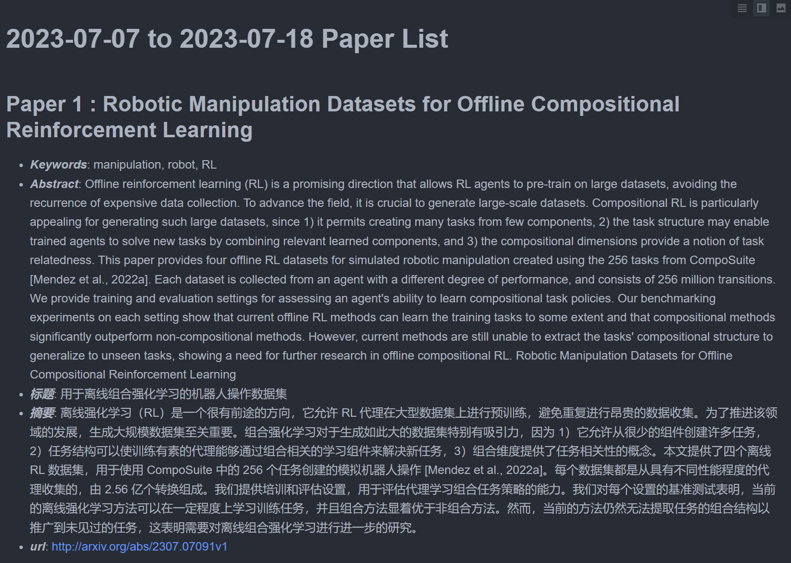

# auto-arxiv
A simple tool to collect daily arxiv papers and write the content to a markdown file. The papers are sorted by the total score.

### Example Image


### Settings in `config.yaml`
``` python
# subject_query: the subject of the papers you want to collect
#subject_query: 'cat:cs.RO OR cat:cs.AI OR cat:cs.ML'
subject_query: 'cat:cs.*'

# keyword_query: the keywords of the papers you want to collect, and give the keywords a weight (score)
keyword_query:
  key1:
    keywords:
      - "manipulation"
      - "LLM, VLM"
    weight: 2
  key2:
    keywords:
      - "RL"
      - "LLM"
      - "manipulation"
    weight: 6
# the keyword_query will be formated as the pair:
# e.g. key1: keywords: [(manipulation, LLM),(manipulation, VLM)] weight: 2
#      key2: keywords: [(RL, LLM, manipulation)]
# the keywords in tuple will be connected by "AND"
```

### Tricks
- You can set the `days_before` to collect the papers in the past weekdays.
- You can set the `strict=True` to let the keywords in the abstract of collected papers.
- You can set the `translator` to translate the title and abstract of the papers to your language (e.g. Chinese).
- The paper without keywords will be listed at the end of the markdown file. Though it doesn't include any keywords, it may be interesting to you.

### Thanks
- Carrier-Owl: https://github.com/fkubota/Carrier-Owl
- arxiv-py: https://github.com/lukasschwab/arxiv.py

